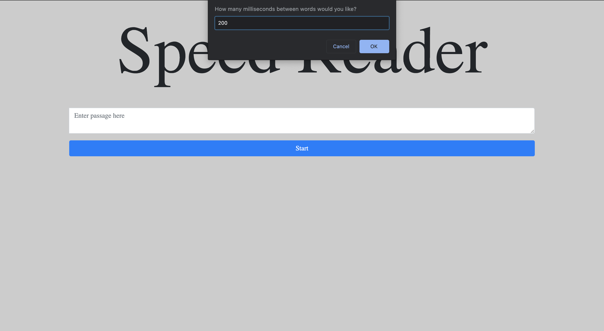
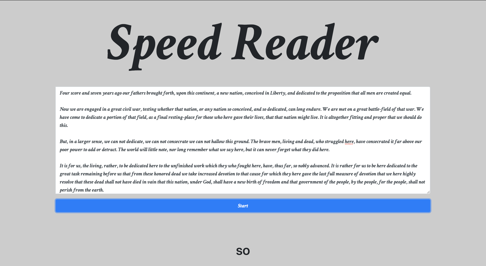

# Speed Reader

  
  

## Description 

This application allows you to enter any passage you would like to speed read. You can manually adjust the speed at which the words are rendered on the webpage.

See the URL for the deployed application: meierj423.github.io/speed-reader/

## Table of Contents

* [License](#license)
* [Questions](#questions)

## License

This application is covered under the MIT license.

## Questions

For any additional questions, please send me an e-mail at jackson.meier423@gmail.com

Link to my GitHub: https://github.com/meierj423
